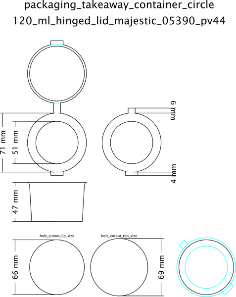
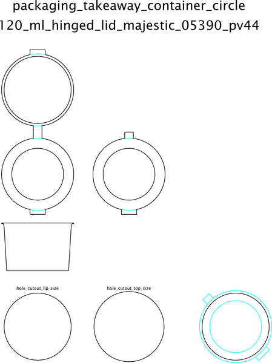

# Packaging Takeaway Container Circle 120 Ml Hinged Lid Majestic 05390 Pv44  

note: This is part of OOMP the Oopen Organization Method For Parts. For more details: https://github.com/oomlout/oomp_base

##  part details

### id
* oomp_id: packaging_takeaway_container_circle_120_ml_hinged_lid_majestic_05390_pv44
  * classification: packaging
  * type: takeaway_container_circle
  * size: 120_ml
  * color: 
  * description_main: hinged_lid
  * description_extra: 
  * manufacturer: majestic
  * part_number: 05390_pv44

### other_codes
* short_code: tcc120hl
* oomp_word: car phone koala
* oomp_word_emoji :car: :phone: :koala:
* md5_6_alpha: 96s6y
* md5_6: eb7d3a

### all codes 
| key | value |  
| --- | --- |  
| classification | packaging |  
| classification_capital | Packaging |  
| classification_first_letter | p |  
| classification_first_letter_upper | P |  
| classification_length_1 | p |  
| classification_length_2 | pa |  
| classification_length_3 | pac |  
| classification_length_4 | pack |  
| classification_length_5 | packa |  
| classification_length_6 | packag |  
| classification_name | Packaging |  
| classification_no_space_length_1 | p |  
| classification_no_space_length_2 | pa |  
| classification_no_space_length_3 | pac |  
| classification_no_space_length_4 | pack |  
| classification_no_space_length_5 | packa |  
| classification_no_space_length_6 | packag |  
| classification_no_space_upper_length_1 | P |  
| classification_no_space_upper_length_2 | PA |  
| classification_no_space_upper_length_3 | PAC |  
| classification_no_space_upper_length_4 | PACK |  
| classification_no_space_upper_length_5 | PACKA |  
| classification_no_space_upper_length_6 | PACKAG |  
| classification_upper | PACKAGING |  
| classification_upper_length_1 | P |  
| classification_upper_length_2 | PA |  
| classification_upper_length_3 | PAC |  
| classification_upper_length_4 | PACK |  
| classification_upper_length_5 | PACKA |  
| classification_upper_length_6 | PACKAG |  
| color |  |  
| color_capital |  |  
| color_first_letter |  |  
| color_first_letter_upper |  |  
| color_name |  |  
| color_upper |  |  
| cost_per | £0.0324 |  
| cost_per_100 | £0.073 |  
| cost_per_1000 | £0.057 |  
| cost_per_ebay | £0.11 |  
| description_extra |  |  
| description_extra_capital |  |  
| description_extra_first_letter |  |  
| description_extra_first_letter_upper |  |  
| description_extra_name |  |  
| description_extra_upper |  |  
| description_main | hinged_lid |  
| description_main_capital | Hinged Lid |  
| description_main_first_letter | h |  
| description_main_first_letter_upper | H |  
| description_main_length_1 | h |  
| description_main_length_2 | hi |  
| description_main_length_3 | hin |  
| description_main_length_4 | hing |  
| description_main_length_5 | hinge |  
| description_main_length_6 | hinged |  
| description_main_name | Hinged Lid |  
| description_main_no_space_length_1 | h |  
| description_main_no_space_length_2 | hi |  
| description_main_no_space_length_3 | hin |  
| description_main_no_space_length_4 | hing |  
| description_main_no_space_length_5 | hinge |  
| description_main_no_space_length_6 | hinged |  
| description_main_no_space_upper_length_1 | H |  
| description_main_no_space_upper_length_2 | HI |  
| description_main_no_space_upper_length_3 | HIN |  
| description_main_no_space_upper_length_4 | HING |  
| description_main_no_space_upper_length_5 | HINGE |  
| description_main_no_space_upper_length_6 | HINGED |  
| description_main_upper | HINGED_LID |  
| description_main_upper_length_1 | H |  
| description_main_upper_length_2 | HI |  
| description_main_upper_length_3 | HIN |  
| description_main_upper_length_4 | HING |  
| description_main_upper_length_5 | HINGE |  
| description_main_upper_length_6 | HINGED |  
| description_only_numbers |  |  
| description_only_numbers_short |   |  
| description_or_color |   |  
| description_or_color_upper |   |  
| directory | parts/packaging_takeaway_container_circle_120_ml_hinged_lid_majestic_05390_pv44 |  
| distributors | [] |  
| github_link | https://github.com/oomlout/oomlout_oomp_part_src/tree/main/parts/packaging_takeaway_container_circle_120_ml_hinged_lid_majestic_05390_pv44 |  
| id | packaging_takeaway_container_circle_120_ml_hinged_lid_majestic_05390_pv44 |  
| id_no_class | takeaway_container_circle_120_ml_hinged_lid_majestic_05390_pv44 |  
| id_no_color | hingedlidmajestic05390pv44 |  
| id_no_size | hinged_lid_majestic_05390_pv44 |  
| id_no_type | 120_ml_hinged_lid_majestic_05390_pv44 |  
| link_purchase | ['https://www.amazon.co.uk/dp/B071P1XVLT?psc=1&smid=A2RGWAHP8GK42C&ref_=chk_typ_imgToDp', 'https://www.ebay.co.uk/itm/175662239573?var=475027888760'] |  
| manufacturer | majestic |  
| manufacturer_capital | Majestic |  
| manufacturer_first_letter | m |  
| manufacturer_first_letter_upper | M |  
| manufacturer_length_1 | m |  
| manufacturer_length_2 | ma |  
| manufacturer_length_3 | maj |  
| manufacturer_length_4 | maje |  
| manufacturer_length_5 | majes |  
| manufacturer_length_6 | majest |  
| manufacturer_name | Majestic |  
| manufacturer_no_space_length_1 | m |  
| manufacturer_no_space_length_2 | ma |  
| manufacturer_no_space_length_3 | maj |  
| manufacturer_no_space_length_4 | maje |  
| manufacturer_no_space_length_5 | majes |  
| manufacturer_no_space_length_6 | majest |  
| manufacturer_no_space_upper_length_1 | M |  
| manufacturer_no_space_upper_length_2 | MA |  
| manufacturer_no_space_upper_length_3 | MAJ |  
| manufacturer_no_space_upper_length_4 | MAJE |  
| manufacturer_no_space_upper_length_5 | MAJES |  
| manufacturer_no_space_upper_length_6 | MAJEST |  
| manufacturer_upper | MAJESTIC |  
| manufacturer_upper_length_1 | M |  
| manufacturer_upper_length_2 | MA |  
| manufacturer_upper_length_3 | MAJ |  
| manufacturer_upper_length_4 | MAJE |  
| manufacturer_upper_length_5 | MAJES |  
| manufacturer_upper_length_6 | MAJEST |  
| manufacturers | [] |  
| markdown_full | [packaging_takeaway_container_circle_120_ml_hinged_lid_majestic_05390_pv44](https://github.com/oomlout/oomlout_oomp_part_src/tree/main/parts/packaging_takeaway_container_circle_120_ml_hinged_lid_majestic_05390_pv44/working)  [Packaging Takeaway Container Circle 120 Ml Hinged Lid Majestic 05390 Pv44](https://github.com/oomlout/oomlout_oomp_part_src/tree/main/parts/packaging_takeaway_container_circle_120_ml_hinged_lid_majestic_05390_pv44/working)   |  
| markdown_short | [packaging_takeaway_container_circle_120_ml_hinged_lid_majestic_05390_pv44](https://github.com/oomlout/oomlout_oomp_part_src/tree/main/parts/packaging_takeaway_container_circle_120_ml_hinged_lid_majestic_05390_pv44/working)   |  
| md5 | eb7d3aac78ff45b5800a8f2328b49c5c |  
| md5_10 | eb7d3aac78 |  
| md5_10_upper | EB7D3AAC78 |  
| md5_5 | eb7d3 |  
| md5_5_upper | EB7D3 |  
| md5_6 | eb7d3a |  
| md5_6_alpha | 96s6y |  
| md5_6_alpha_upper | 96S6Y |  
| md5_6_upper | EB7D3A |  
| name | Packaging Takeaway Container Circle 120 Ml Hinged Lid Majestic 05390 Pv44 |  
| name_no_class | Takeaway Container Circle 120 Ml Hinged Lid Majestic 05390 Pv44 |  
| name_no_color | Hingedlidmajestic05390Pv44 |  
| name_no_size | Hinged Lid Majestic 05390 Pv44 |  
| name_no_size_short | Hinged Lid Majestic 05390 Pv44 |  
| name_no_type | 120 Ml Hinged Lid Majestic 05390 Pv44 |  
| oomlout_mechanical_hole_cutout_12_mm_lift | 57 mm |  
| oomlout_mechanical_hole_cutout_lip_size | 66 mm |  
| oomlout_mechanical_hole_cutout_size | 66 mm |  
| oomlout_mechanical_hole_cutout_top_size | 69 mm |  
| oomlout_short_code | tcc120hl |  
| oomlout_short_code_upper | TCC120HL |  
| oomp_key | oomp_packaging_takeaway_container_circle_120_ml_hinged_lid_majestic_05390_pv44 |  
| oomp_word | car phone koala |  
| oomp_word_emoji | :car: :phone: :koala: |  
| oomp_word_emoji_list | [':car:', ':phone:', ':koala:'] |  
| oomp_word_list | ['car', 'phone', 'koala'] |  
| part_number | 05390_pv44 |  
| part_number_capital | 05390 Pv44 |  
| part_number_first_letter | 0 |  
| part_number_first_letter_upper | 0 |  
| part_number_length_1 | 0 |  
| part_number_length_2 | 05 |  
| part_number_length_3 | 053 |  
| part_number_length_4 | 0539 |  
| part_number_length_5 | 05390 |  
| part_number_length_6 | 05390_ |  
| part_number_name | 05390 Pv44 |  
| part_number_no_space_length_1 | 0 |  
| part_number_no_space_length_2 | 05 |  
| part_number_no_space_length_3 | 053 |  
| part_number_no_space_length_4 | 0539 |  
| part_number_no_space_length_5 | 05390 |  
| part_number_no_space_length_6 | 05390p |  
| part_number_no_space_upper_length_1 | 0 |  
| part_number_no_space_upper_length_2 | 05 |  
| part_number_no_space_upper_length_3 | 053 |  
| part_number_no_space_upper_length_4 | 0539 |  
| part_number_no_space_upper_length_5 | 05390 |  
| part_number_no_space_upper_length_6 | 05390P |  
| part_number_upper | 05390_PV44 |  
| part_number_upper_length_1 | 0 |  
| part_number_upper_length_2 | 05 |  
| part_number_upper_length_3 | 053 |  
| part_number_upper_length_4 | 0539 |  
| part_number_upper_length_5 | 05390 |  
| part_number_upper_length_6 | 05390_ |  
| short_code |  |  
| short_code_upper |  |  
| short_name |  |  
| size | 120_ml |  
| size_capital | 120 Ml |  
| size_first_letter | 1 |  
| size_first_letter_upper | 1 |  
| size_length_1 | 1 |  
| size_length_2 | 12 |  
| size_length_3 | 120 |  
| size_length_4 | 120_ |  
| size_length_5 | 120_m |  
| size_length_6 | 120_ml |  
| size_name | 120 Ml |  
| size_no_space_length_1 | 1 |  
| size_no_space_length_2 | 12 |  
| size_no_space_length_3 | 120 |  
| size_no_space_length_4 | 120m |  
| size_no_space_length_5 | 120ml |  
| size_no_space_length_6 | 120ml |  
| size_no_space_upper_length_1 | 1 |  
| size_no_space_upper_length_2 | 12 |  
| size_no_space_upper_length_3 | 120 |  
| size_no_space_upper_length_4 | 120M |  
| size_no_space_upper_length_5 | 120ML |  
| size_no_space_upper_length_6 | 120ML |  
| size_only_numbers | 120 |  
| size_only_numbers_no_zeros | 12 |  
| size_upper | 120_ML |  
| size_upper_length_1 | 1 |  
| size_upper_length_2 | 12 |  
| size_upper_length_3 | 120 |  
| size_upper_length_4 | 120_ |  
| size_upper_length_5 | 120_M |  
| size_upper_length_6 | 120_ML |  
| type | takeaway_container_circle |  
| type_capital | Takeaway Container Circle |  
| type_first_letter | t |  
| type_first_letter_upper | T |  
| type_length_1 | t |  
| type_length_2 | ta |  
| type_length_3 | tak |  
| type_length_4 | take |  
| type_length_5 | takea |  
| type_length_6 | takeaw |  
| type_name | Takeaway Container Circle |  
| type_no_space_length_1 | t |  
| type_no_space_length_2 | ta |  
| type_no_space_length_3 | tak |  
| type_no_space_length_4 | take |  
| type_no_space_length_5 | takea |  
| type_no_space_length_6 | takeaw |  
| type_no_space_upper_length_1 | T |  
| type_no_space_upper_length_2 | TA |  
| type_no_space_upper_length_3 | TAK |  
| type_no_space_upper_length_4 | TAKE |  
| type_no_space_upper_length_5 | TAKEA |  
| type_no_space_upper_length_6 | TAKEAW |  
| type_upper | TAKEAWAY_CONTAINER_CIRCLE |  
| type_upper_length_1 | T |  
| type_upper_length_2 | TA |  
| type_upper_length_3 | TAK |  
| type_upper_length_4 | TAKE |  
| type_upper_length_5 | TAKEA |  
| type_upper_length_6 | TAKEAW |  
| upc_number |  |  
| weight | 7.53 g |  
