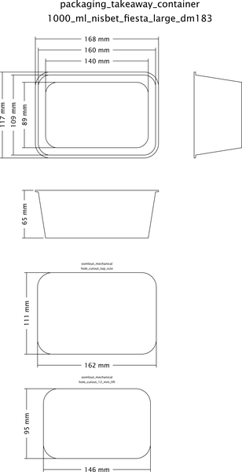

# Packaging Takeaway Container Rectangle 1000 Ml Nisbet Fiesta Large Dm183  

note: This is part of OOMP the Oopen Organization Method For Parts. For more details: https://github.com/oomlout/oomp_base

##  part details

### id
* oomp_id: packaging_takeaway_container_rectangle_1000_ml_nisbet_fiesta_large_dm183
  * classification: packaging
  * type: takeaway_container_rectangle
  * size: 1000_ml
  * color: 
  * description_main: 
  * description_extra: 
  * manufacturer: nisbet_fiesta
  * part_number: large_dm183

### other_codes
* short_code: tcr1000
* oomp_word: hatching_chick bear ring
* oomp_word_emoji :hatching_chick: :bear: :ring:
* md5_6_alpha: 2uv8g
* md5_6: 493ba0

### all codes 
| key | value |  
| --- | --- |  
| classification | packaging |  
| classification_capital | Packaging |  
| classification_first_letter | p |  
| classification_first_letter_upper | P |  
| classification_length_1 | p |  
| classification_length_2 | pa |  
| classification_length_3 | pac |  
| classification_length_4 | pack |  
| classification_length_5 | packa |  
| classification_length_6 | packag |  
| classification_name | Packaging |  
| classification_no_space_length_1 | p |  
| classification_no_space_length_2 | pa |  
| classification_no_space_length_3 | pac |  
| classification_no_space_length_4 | pack |  
| classification_no_space_length_5 | packa |  
| classification_no_space_length_6 | packag |  
| classification_no_space_upper_length_1 | P |  
| classification_no_space_upper_length_2 | PA |  
| classification_no_space_upper_length_3 | PAC |  
| classification_no_space_upper_length_4 | PACK |  
| classification_no_space_upper_length_5 | PACKA |  
| classification_no_space_upper_length_6 | PACKAG |  
| classification_upper | PACKAGING |  
| classification_upper_length_1 | P |  
| classification_upper_length_2 | PA |  
| classification_upper_length_3 | PAC |  
| classification_upper_length_4 | PACK |  
| classification_upper_length_5 | PACKA |  
| classification_upper_length_6 | PACKAG |  
| color |  |  
| color_capital |  |  
| color_first_letter |  |  
| color_first_letter_upper |  |  
| color_name |  |  
| color_upper |  |  
| description_extra |  |  
| description_extra_capital |  |  
| description_extra_first_letter |  |  
| description_extra_first_letter_upper |  |  
| description_extra_name |  |  
| description_extra_upper |  |  
| description_main |  |  
| description_main_capital |  |  
| description_main_first_letter |  |  
| description_main_first_letter_upper |  |  
| description_main_name |  |  
| description_main_upper |  |  
| description_only_numbers |  |  
| description_only_numbers_short |   |  
| description_or_color |   |  
| description_or_color_upper |   |  
| directory | parts/packaging_takeaway_container_rectangle_1000_ml_nisbet_fiesta_large_dm183 |  
| distributors | [] |  
| github_link | https://github.com/oomlout/oomlout_oomp_part_src/tree/main/parts/packaging_takeaway_container_rectangle_1000_ml_nisbet_fiesta_large_dm183 |  
| id | packaging_takeaway_container_rectangle_1000_ml_nisbet_fiesta_large_dm183 |  
| id_no_class | takeaway_container_rectangle_1000_ml_nisbet_fiesta_large_dm183 |  
| id_no_color | nisbetfiestalargedm183 |  
| id_no_size | nisbet_fiesta_large_dm183 |  
| id_no_type | 1000_ml_nisbet_fiesta_large_dm183 |  
| manufacturer | nisbet_fiesta |  
| manufacturer_capital | Nisbet Fiesta |  
| manufacturer_first_letter | n |  
| manufacturer_first_letter_upper | N |  
| manufacturer_length_1 | n |  
| manufacturer_length_2 | ni |  
| manufacturer_length_3 | nis |  
| manufacturer_length_4 | nisb |  
| manufacturer_length_5 | nisbe |  
| manufacturer_length_6 | nisbet |  
| manufacturer_name | Nisbet Fiesta |  
| manufacturer_no_space_length_1 | n |  
| manufacturer_no_space_length_2 | ni |  
| manufacturer_no_space_length_3 | nis |  
| manufacturer_no_space_length_4 | nisb |  
| manufacturer_no_space_length_5 | nisbe |  
| manufacturer_no_space_length_6 | nisbet |  
| manufacturer_no_space_upper_length_1 | N |  
| manufacturer_no_space_upper_length_2 | NI |  
| manufacturer_no_space_upper_length_3 | NIS |  
| manufacturer_no_space_upper_length_4 | NISB |  
| manufacturer_no_space_upper_length_5 | NISBE |  
| manufacturer_no_space_upper_length_6 | NISBET |  
| manufacturer_upper | NISBET_FIESTA |  
| manufacturer_upper_length_1 | N |  
| manufacturer_upper_length_2 | NI |  
| manufacturer_upper_length_3 | NIS |  
| manufacturer_upper_length_4 | NISB |  
| manufacturer_upper_length_5 | NISBE |  
| manufacturer_upper_length_6 | NISBET |  
| manufacturers | [] |  
| markdown_full | [packaging_takeaway_container_rectangle_1000_ml_nisbet_fiesta_large_dm183](https://github.com/oomlout/oomlout_oomp_part_src/tree/main/parts/packaging_takeaway_container_rectangle_1000_ml_nisbet_fiesta_large_dm183/working)  [Packaging Takeaway Container Rectangle 1000 Ml Nisbet Fiesta Large Dm183](https://github.com/oomlout/oomlout_oomp_part_src/tree/main/parts/packaging_takeaway_container_rectangle_1000_ml_nisbet_fiesta_large_dm183/working)   |  
| markdown_short | [packaging_takeaway_container_rectangle_1000_ml_nisbet_fiesta_large_dm183](https://github.com/oomlout/oomlout_oomp_part_src/tree/main/parts/packaging_takeaway_container_rectangle_1000_ml_nisbet_fiesta_large_dm183/working)   |  
| md5 | 493ba0395edb6cdbf8d392393348d874 |  
| md5_10 | 493ba0395e |  
| md5_10_upper | 493BA0395E |  
| md5_5 | 493ba |  
| md5_5_upper | 493BA |  
| md5_6 | 493ba0 |  
| md5_6_alpha | 2uv8g |  
| md5_6_alpha_upper | 2UV8G |  
| md5_6_upper | 493BA0 |  
| name | Packaging Takeaway Container Rectangle 1000 Ml Nisbet Fiesta Large Dm183 |  
| name_no_class | Takeaway Container Rectangle 1000 Ml Nisbet Fiesta Large Dm183 |  
| name_no_color | Nisbetfiestalargedm183 |  
| name_no_size | Nisbet Fiesta Large Dm183 |  
| name_no_size_short | Nisbet Fiesta Large Dm183 |  
| name_no_type | 1000 Ml Nisbet Fiesta Large Dm183 |  
| oomlout_short_code | tcr1000 |  
| oomlout_short_code_upper | TCR1000 |  
| oomp_key | oomp_packaging_takeaway_container_rectangle_1000_ml_nisbet_fiesta_large_dm183 |  
| oomp_word | hatching_chick bear ring |  
| oomp_word_emoji | :hatching_chick: :bear: :ring: |  
| oomp_word_emoji_list | [':hatching_chick:', ':bear:', ':ring:'] |  
| oomp_word_list | ['hatching_chick', 'bear', 'ring'] |  
| part_number | large_dm183 |  
| part_number_capital | Large Dm183 |  
| part_number_first_letter | l |  
| part_number_first_letter_upper | L |  
| part_number_length_1 | l |  
| part_number_length_2 | la |  
| part_number_length_3 | lar |  
| part_number_length_4 | larg |  
| part_number_length_5 | large |  
| part_number_length_6 | large_ |  
| part_number_name | Large Dm183 |  
| part_number_no_space_length_1 | l |  
| part_number_no_space_length_2 | la |  
| part_number_no_space_length_3 | lar |  
| part_number_no_space_length_4 | larg |  
| part_number_no_space_length_5 | large |  
| part_number_no_space_length_6 | larged |  
| part_number_no_space_upper_length_1 | L |  
| part_number_no_space_upper_length_2 | LA |  
| part_number_no_space_upper_length_3 | LAR |  
| part_number_no_space_upper_length_4 | LARG |  
| part_number_no_space_upper_length_5 | LARGE |  
| part_number_no_space_upper_length_6 | LARGED |  
| part_number_upper | LARGE_DM183 |  
| part_number_upper_length_1 | L |  
| part_number_upper_length_2 | LA |  
| part_number_upper_length_3 | LAR |  
| part_number_upper_length_4 | LARG |  
| part_number_upper_length_5 | LARGE |  
| part_number_upper_length_6 | LARGE_ |  
| short_code |  |  
| short_code_upper |  |  
| short_name |  |  
| size | 1000_ml |  
| size_capital | 1000 Ml |  
| size_first_letter | 1 |  
| size_first_letter_upper | 1 |  
| size_length_1 | 1 |  
| size_length_2 | 10 |  
| size_length_3 | 100 |  
| size_length_4 | 1000 |  
| size_length_5 | 1000_ |  
| size_length_6 | 1000_m |  
| size_name | 1000 Ml |  
| size_no_space_length_1 | 1 |  
| size_no_space_length_2 | 10 |  
| size_no_space_length_3 | 100 |  
| size_no_space_length_4 | 1000 |  
| size_no_space_length_5 | 1000m |  
| size_no_space_length_6 | 1000ml |  
| size_no_space_upper_length_1 | 1 |  
| size_no_space_upper_length_2 | 10 |  
| size_no_space_upper_length_3 | 100 |  
| size_no_space_upper_length_4 | 1000 |  
| size_no_space_upper_length_5 | 1000M |  
| size_no_space_upper_length_6 | 1000ML |  
| size_only_numbers | 1000 |  
| size_only_numbers_no_zeros | 1 |  
| size_upper | 1000_ML |  
| size_upper_length_1 | 1 |  
| size_upper_length_2 | 10 |  
| size_upper_length_3 | 100 |  
| size_upper_length_4 | 1000 |  
| size_upper_length_5 | 1000_ |  
| size_upper_length_6 | 1000_M |  
| type | takeaway_container_rectangle |  
| type_capital | Takeaway Container Rectangle |  
| type_first_letter | t |  
| type_first_letter_upper | T |  
| type_length_1 | t |  
| type_length_2 | ta |  
| type_length_3 | tak |  
| type_length_4 | take |  
| type_length_5 | takea |  
| type_length_6 | takeaw |  
| type_name | Takeaway Container Rectangle |  
| type_no_space_length_1 | t |  
| type_no_space_length_2 | ta |  
| type_no_space_length_3 | tak |  
| type_no_space_length_4 | take |  
| type_no_space_length_5 | takea |  
| type_no_space_length_6 | takeaw |  
| type_no_space_upper_length_1 | T |  
| type_no_space_upper_length_2 | TA |  
| type_no_space_upper_length_3 | TAK |  
| type_no_space_upper_length_4 | TAKE |  
| type_no_space_upper_length_5 | TAKEA |  
| type_no_space_upper_length_6 | TAKEAW |  
| type_upper | TAKEAWAY_CONTAINER_RECTANGLE |  
| type_upper_length_1 | T |  
| type_upper_length_2 | TA |  
| type_upper_length_3 | TAK |  
| type_upper_length_4 | TAKE |  
| type_upper_length_5 | TAKEA |  
| type_upper_length_6 | TAKEAW |  
